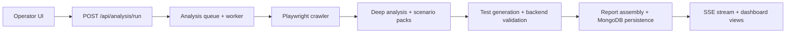
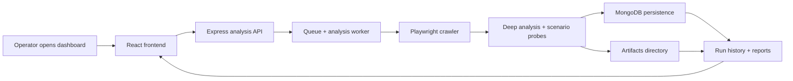
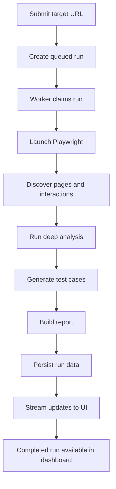
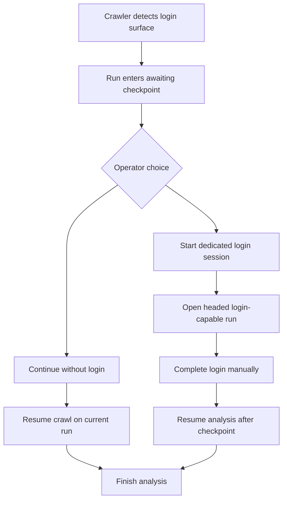
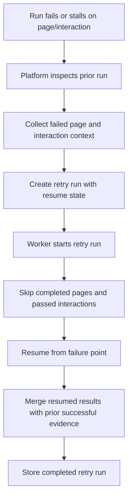
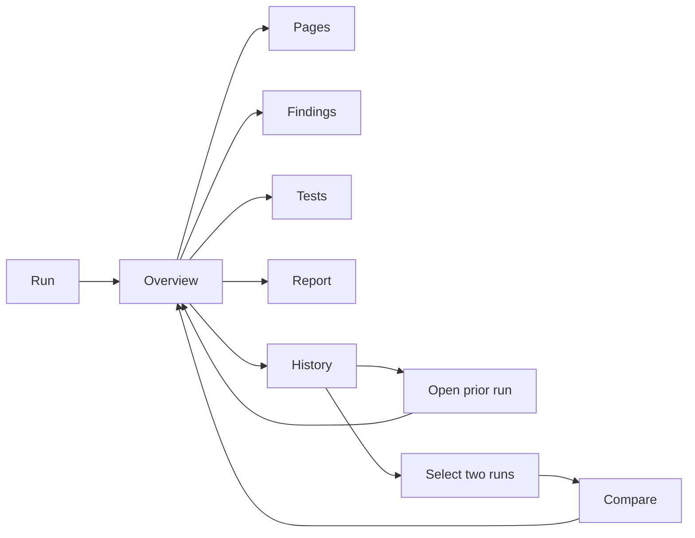
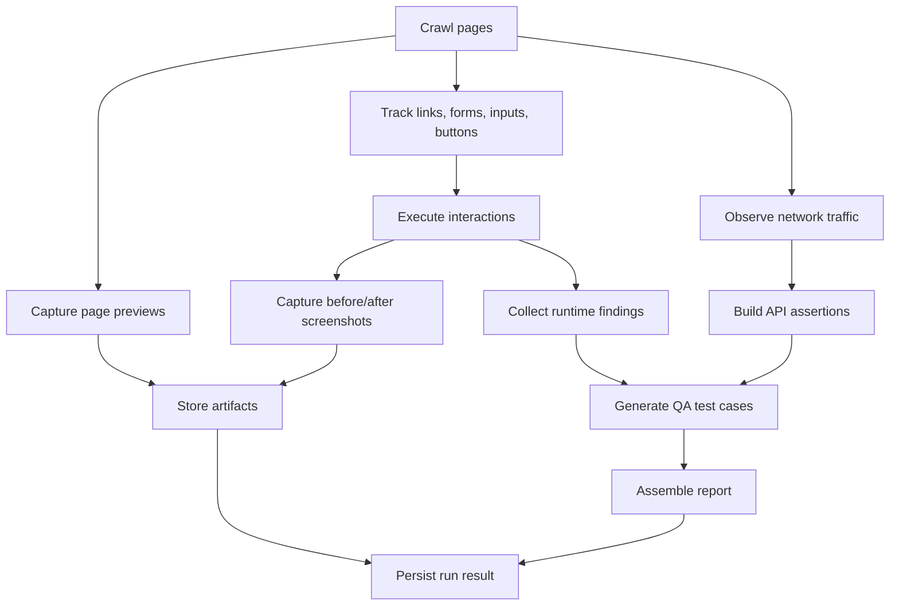

# SK CrawlPulse

SK CrawlPulse is a full-stack autonomous web QA workspace. It crawls a target website with Playwright, inspects pages and interactions, captures evidence, generates structured test cases, correlates observed API traffic with optional backend context, and presents the results in a React dashboard with live run updates.

This repository contains:

- a React + Vite operator console in `frontend/`
- a Node.js + Express + TypeScript analysis API in `backend/`
- sample report material in `docs/`

## What the project does

Given a target URL, SK CrawlPulse can:

- discover pages, routes, links, forms, inputs, and visible interactive elements
- execute interaction checks and capture before/after evidence
- detect runtime issues such as request failures, JS exceptions, accessibility risks, boundary-limit problems, and visual instability signals
- run scenario-oriented probes for flows like auth, search, forms, pagination, tables, filters, uploads, and cart-like actions
- stream run progress to the frontend through Server-Sent Events
- persist runs, pages, logs, interactions, artifacts, and completed reports in MongoDB
- retry failed runs and resume around failed pages or interactions
- raise login checkpoints and optionally continue in a dedicated headed login session
- compare historical runs to review new, fixed, and persistent issues

## Tech stack

- Frontend: React 19, TypeScript, Vite, Tailwind CSS
- Backend: Node.js, Express 5, TypeScript
- Browser automation: Playwright
- Persistence: MongoDB with Mongoose
- Streaming: Server-Sent Events

## Architecture



### System architecture flow



### Runtime flow

1. The operator submits a website URL and optional backend ownership context.
2. The backend creates a queued analysis run in MongoDB.
3. A worker claims the run and launches Playwright.
4. The crawler discovers pages, extracts UI structure, tracks network traffic, and tests interactions.
5. Deep analysis adds accessibility, visual, API, boundary, and scenario-pack findings.
6. The platform generates test cases and builds a report package.
7. Progress snapshots are streamed live to the frontend.
8. Final results remain available in history, report, findings, tests, and comparison views.

### Analysis run lifecycle



### Login checkpoint flow



### Retry and resume flow



## Repository structure

```text
sk-testing/
  backend/
    src/
      app.ts
      server.ts
      config/             environment and MongoDB setup
      middleware/         Express error handling
      lib/                shared backend primitives
      models/             Mongoose models for runs, pages, logs, interactions, artifacts
      modules/
        frontend/         crawler, deep analysis, test generation
        backend/          API/backend correlation
        platform/         queueing, worker execution, streaming, retention
        reporting/        report and flowchart generation
      routes/             REST API routes
      types/              shared backend-side contracts
      utils/              URL helpers
  frontend/
    src/
      App.tsx             main operator shell
      components/         dashboard views and UI sections
      config/             frontend runtime configuration
      data/               dashboard metadata/content helpers
      types/              frontend contracts
  docs/
    project-overview.md
    examples/
      report-example.json
      report-pdf-outline.md
```

## Main frontend views

- `Overview`: high-level summary of coverage, findings, and report signals
- `Run`: target submission, live progress, retry flow, and checkpoint handling
- `Pages`: discovered routes, headings, buttons, links, forms, and HTML previews
- `Findings`: runtime findings with filtering by route, severity, status, and issue type
- `Tests`: generated QA test cases with evidence and issue summaries
- `Report`: report sections, backend observations, and Mermaid flow output
- `History`: previously stored runs with reopen support
- `Compare`: side-by-side run comparison for regressions and fixes

### Frontend view navigation flow



## Local setup

### Prerequisites

- Node.js and npm
- MongoDB reachable through a connection string
- A Chromium-compatible browser available for Playwright

### Install

```bash
cd backend
npm install

cd ../frontend
npm install
```

### Run in development

Terminal 1:

```bash
cd backend
npm run dev
```

Terminal 2:

```bash
cd frontend
npm run dev
```

Then open the Vite app URL shown by the frontend dev server, usually `http://localhost:5173`.

## Output and stored artifacts

The platform produces:

- stored run metadata and progress snapshots
- discovered page inventories
- interaction results
- live and failure screenshots
- scenario and boundary evidence
- generated QA test cases
- backend/API validation observations
- report sections and Mermaid flowchart content

Generated file artifacts are written under `backend/artifacts/` and are intentionally ignored by Git.

### Artifact generation flow



## Documentation and examples

- [Project overview](C:/Users/samrasto/OneDrive%20-%20Nokia/Desktop/sk-testing/docs/project-overview.md)
- [Sample report outline](C:/Users/samrasto/OneDrive%20-%20Nokia/Desktop/sk-testing/docs/examples/report-pdf-outline.md)
- [Sample report payload](C:/Users/samrasto/OneDrive%20-%20Nokia/Desktop/sk-testing/docs/examples/report-example.json)

## Current limitations

- There is no root-level workspace runner yet; frontend and backend are started separately.
- The repository does not currently include automated test suites.
- MongoDB is required for the backend to start.
- Some analysis behavior is heuristic by design and depends on the target website structure.
- Large crawls and headed login flows can create substantial local artifacts.

## Suggested next improvements

- add `backend/.env.example` and optional `frontend/.env.example`
- add a root workspace script for install, dev, and build
- add automated tests for API routes, orchestration, and key frontend views
- add CI validation for build, lint, and type safety
- add exportable polished PDF generation for final reports
